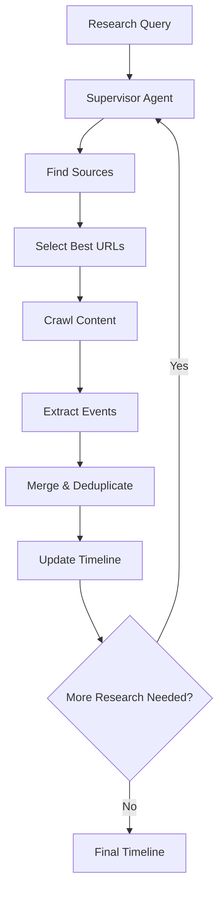

<!-- Improved compatibility of back to top link: See: https://github.com/othneildrew/Best-README-Template/pull/73 -->

<a id="readme-top"></a>

<!-- PROJECT SHIELDS -->

[![Contributors][contributors-shield]][contributors-url]
[![Forks][forks-shield]][forks-url]
[![Stargazers][stars-shield]][stars-url]
[![Issues][issues-shield]][issues-url]
[![MIT License][license-shield]][license-url]

<!-- PROJECT LOGO -->
<br />
<div align="center">
  <a href="https://github.com/bernatsampera/deep-event-research">
    
  </a>

  <h3 align="center">Deep Event Research</h3>

  <p align="center">
    AI-powered biographical research agent that discovers and compiles life events of historical figures
    <br />
    <a href="https://github.com/bernatsampera/deep-event-research"><strong>Explore the docs »</strong></a>
    <br />
    <br />
    <a href="https://github.com/bernatsampera/deep-event-research/issues/new?labels=bug&template=bug-report---.md">Report Bug</a>
    &middot;
    <a href="https://github.com/bernatsampera/deep-event-research/issues/new?labels=enhancement&template=feature-request---.md">Request Feature</a>
  </p>
</div>

<!-- TABLE OF CONTENTS -->
<details>
  <summary>Table of Contents</summary>
  <ol>
    <li>
      <a href="#about-the-project">About The Project</a>
      <ul>
        <li><a href="#built-with">Built With</a></li>
      </ul>
    </li>
    <li>
      <a href="#getting-started">Getting Started</a>
      <ul>
        <li><a href="#prerequisites">Prerequisites</a></li>
        <li><a href="#installation">Installation</a></li>
        <li><a href="#configuration">Configuration</a></li>
      </ul>
    </li>
    <li><a href="#usage">Usage</a></li>
    <li><a href="#architecture">Architecture</a></li>
    <li><a href="#roadmap">Roadmap</a></li>
    <li><a href="#contributing">Contributing</a></li>
    <li><a href="#license">License</a></li>
    <li><a href="#contact">Contact</a></li>
    <li><a href="#acknowledgments">Acknowledgments</a></li>
  </ol>
</details>

<!-- ABOUT THE PROJECT -->

## About The Project

Deep Event Research is an intelligent AI agent that automatically discovers, extracts, and compiles biographical events of historical figures. Built with LangGraph, it uses advanced context engineering techniques and a supervisor pattern to orchestrate multiple research agents that work together to create comprehensive life timelines.

Here's why this project is unique:

- **🤖 Multi-Agent Architecture**: Uses LangGraph's supervisor pattern to coordinate specialized research agents
- **🔍 Intelligent Source Selection**: Automatically finds and evaluates the best biographical sources using Tavily search
- **📚 Smart Event Categorization**: Organizes events into meaningful categories (early life, personal, career, legacy)
- **🔄 Event Merging & Deduplication**: Intelligently combines information from multiple sources while avoiding duplicates
- **📊 Full Observability**: Integrated with Langfuse for complete research process tracking
- **⚡ Context Engineering**: Advanced prompt engineering techniques for accurate event extraction

Perfect for researchers, historians, students, and anyone interested in exploring the lives of historical figures through AI-powered research.

<p align="right">(<a href="#readme-top">back to top</a>)</p>

### Built With

This project leverages cutting-edge AI and web technologies:

- [![LangGraph][langgraph.com]][langgraph-url] - Multi-agent orchestration and workflow management
- [![LangChain][langchain.com]][langchain-url] - LLM integration and tooling
- [![Firecrawl][firecrawl.com]][firecrawl-url] - Advanced web scraping and content extraction
- [![Tavily][tavily.com]][tavily-url] - Intelligent web search and source discovery
- [![Langfuse][langfuse.com]][langfuse-url] - LLM observability and monitoring
- [![Ollama][ollama.com]][ollama-url] - Local LLM inference

<p align="right">(<a href="#readme-top">back to top</a>)</p>

<!-- GETTING STARTED -->

## Getting Started

### Prerequisites

Before you begin, ensure you have the following installed:

- **Python 3.12+**
- **uv** (Python package manager)
- **Ollama** (for local LLM inference)

  ```bash
  # Install Ollama
  curl -fsSL https://ollama.ai/install.sh | sh

  # Pull a model (e.g., Llama 3.1)
  ollama pull llama3.1
  ```

### Installation

1. **Clone the repository**

   ```bash
   git clone https://github.com/bernatsampera/deep-event-research.git
   cd deep-event-research
   ```

2. **Install dependencies**

   ```bash
   uv sync
   ```

3. **Set up environment variables**
   Create a `.env` file in the root directory:

   ```bash
   # Required API Keys
   FIRECRAWL_API_KEY=your_firecrawl_api_key
   TAVILY_API_KEY=your_tavily_api_key

   # Optional: Langfuse for observability
   LANGFUSE_PUBLIC_KEY=your_langfuse_public_key
   LANGFUSE_SECRET_KEY=your_langfuse_secret_key
   LANGFUSE_HOST=https://cloud.langfuse.com

   # LLM Configuration
   OPENAI_API_KEY=your_openai_api_key  # Optional: for OpenAI models
   GOOGLE_API_KEY=your_google_api_key  # Optional: for Google models
   ```

4. **Start LangGraph Studio**
   ```bash
   make dev
   ```

### Configuration

The project uses several configuration files:

- **`langgraph.json`**: Defines the available graphs and their entry points
- **`.env`**: Contains API keys and configuration variables
- **`pyproject.toml`**: Project dependencies and metadata

<p align="right">(<a href="#readme-top">back to top</a>)</p>

<!-- USAGE EXAMPLES -->

## Usage

### Running the Research Agent

1. **Start LangGraph Studio**

   ```bash
   make dev
   ```

2. **Access the Studio Interface**
   Open your browser to `http://localhost:8123`

3. **Run the Supervisor Graph**

   - Select the `supervisor` graph
   - Input your research query:

   ```json
   {
     "person_to_research": "Albert Einstein"
   }
   ```

4. **Monitor the Research Process**
   The agent will automatically:
   - Search for biographical sources
   - Extract relevant events
   - Categorize events by life periods
   - Merge and deduplicate information
   - Provide a comprehensive timeline

### Example Research Output

```json
{
  "existing_events": {
    "early": "Albert Einstein was born on March 14, 1879, in Ulm, Germany...",
    "personal": "Einstein married Mileva Marić in 1903, and they had three children...",
    "career": "In 1905, Einstein published four groundbreaking papers...",
    "legacy": "Einstein's work revolutionized physics and our understanding of the universe..."
  },
  "used_domains": [
    "en.wikipedia.org",
    "www.britannica.com",
    "www.nobelprize.org"
  ]
}
```

### Available Graphs

The project includes several specialized graphs:

- **`supervisor`**: Main orchestration graph that coordinates the research process
- **`research_events`**: Handles source discovery and event extraction
- **`merge_events_graph`**: Merges and deduplicates events from multiple sources
- **`url_crawler`**: Extracts content from web pages

<p align="right">(<a href="#readme-top">back to top</a>)</p>

<!-- ARCHITECTURE -->

## Architecture

Deep Event Research uses a sophisticated multi-agent architecture built on LangGraph:

### Core Components

1. **Supervisor Agent**: The main orchestrator that decides research strategy
2. **Research Events Agent**: Handles source discovery and event extraction
3. **URL Crawler Agent**: Extracts content from web pages
4. **Merge Events Agent**: Combines and deduplicates information

### Research Flow



### Key Features

- **Context Engineering**: Advanced prompt engineering for accurate event extraction
- **Supervisor Pattern**: Intelligent coordination of multiple specialized agents
- **Event Categorization**: Automatic organization into meaningful life periods
- **Source Quality Assessment**: Intelligent selection of the most reliable sources
- **Observability**: Complete tracking of the research process with Langfuse

<p align="right">(<a href="#readme-top">back to top</a>)</p>

<!-- ROADMAP -->

## Roadmap

- [x] Core multi-agent architecture
- [x] Source discovery and selection
- [x] Event extraction and categorization
- [x] Event merging and deduplication
- [x] Langfuse integration for observability
- [ ] Enhanced event validation and fact-checking
- [ ] Support for multiple languages
- [ ] Export to various formats (JSON, CSV, PDF)
- [ ] Web interface for non-technical users
- [ ] Integration with historical databases
- [ ] Real-time collaboration features

See the [open issues](https://github.com/bernatsampera/deep-event-research/issues) for a full list of proposed features and known issues.

<p align="right">(<a href="#readme-top">back to top</a>)</p>

<!-- CONTRIBUTING -->

## Contributing

Contributions are what make the open source community such an amazing place to learn, inspire, and create. Any contributions you make are **greatly appreciated**.

If you have a suggestion that would make this better, please fork the repo and create a pull request. You can also simply open an issue with the tag "enhancement".
Don't forget to give the project a star! Thanks again!

1. Fork the Project
2. Create your Feature Branch (`git checkout -b feature/AmazingFeature`)
3. Commit your Changes (`git commit -m 'Add some AmazingFeature'`)
4. Push to the Branch (`git push origin feature/AmazingFeature`)
5. Open a Pull Request

### Development Setup

1. **Install development dependencies**

   ```bash
   uv sync --dev
   ```

2. **Run tests**

   ```bash
   make test
   ```

3. **Start development server**
   ```bash
   make dev
   ```

### Top contributors:

<a href="https://github.com/bernatsampera/deep-event-research/graphs/contributors">
  
</a>

<p align="right">(<a href="#readme-top">back to top</a>)</p>

<!-- LICENSE -->

## License

Distributed under the MIT License. See `LICENSE.txt` for more information.

<p align="right">(<a href="#readme-top">back to top</a>)</p>

<!-- CONTACT -->

## Contact

**Bernat Sampera** - [@bsampera97](https://x.com/bsampera97) - [GitHub](https://github.com/bernatsampera)

Project Link: [https://github.com/bernatsampera/deep-event-research](https://github.com/bernatsampera/deep-event-research)

<p align="right">(<a href="#readme-top">back to top</a>)</p>

<!-- ACKNOWLEDGMENTS -->

## Acknowledgments

This project was inspired by and builds upon several amazing open-source projects:

- [Open Deep Research](https://github.com/langchain-ai/open_deep_research) by LangChain - For inspiration on deep research methodologies
- [LangChain](https://github.com/langchain-ai/langchain) - For the foundational LLM framework
- [LangGraph](https://github.com/langchain-ai/langgraph) - For the multi-agent orchestration capabilities
- [Firecrawl](https://firecrawl.dev/) - For advanced web scraping capabilities
- [Tavily](https://tavily.com/) - For intelligent web search
- [Langfuse](https://langfuse.com/) - For LLM observability and monitoring

Special thanks to the open-source community for making this project possible!

<p align="right">(<a href="#readme-top">back to top</a>)</p>

<!-- MARKDOWN LINKS & IMAGES -->
<!-- https://www.markdownguide.org/basic-syntax/#reference-style-links -->

[contributors-shield]: https://img.shields.io/github/contributors/bernatsampera/deep-event-research.svg?style=for-the-badge
[contributors-url]: https://github.com/bernatsampera/deep-event-research/graphs/contributors
[forks-shield]: https://img.shields.io/github/forks/bernatsampera/deep-event-research.svg?style=for-the-badge
[forks-url]: https://github.com/bernatsampera/deep-event-research/network/members
[stars-shield]: https://img.shields.io/github/stars/bernatsampera/deep-event-research.svg?style=for-the-badge
[stars-url]: https://github.com/bernatsampera/deep-event-research/stargazers
[issues-shield]: https://img.shields.io/github/issues/bernatsampera/deep-event-research.svg?style=for-the-badge
[issues-url]: https://github.com/bernatsampera/deep-event-research/issues
[license-shield]: https://img.shields.io/github/license/bernatsampera/deep-event-research.svg?style=for-the-badge
[license-url]: https://github.com/bernatsampera/deep-event-research/blob/master/LICENSE.txt
[langgraph.com]: https://img.shields.io/badge/LangGraph-ffffff?logo=python&logoColor=blue
[langgraph-url]: https://github.com/langchain-ai/langgraph
[langchain.com]: https://img.shields.io/badge/LangChain-ffffff?logo=python&logoColor=blue
[langchain-url]: https://www.langchain.com/
[firecrawl.com]: https://img.shields.io/badge/Firecrawl-ffffff?logo=fire&logoColor=orange
[firecrawl-url]: https://firecrawl.dev/
[tavily.com]: https://img.shields.io/badge/Tavily-ffffff?logo=search&logoColor=green
[tavily-url]: https://tavily.com/
[langfuse.com]: https://img.shields.io/badge/Langfuse-ffffff?logo=chart&logoColor=purple
[langfuse-url]: https://langfuse.com/
[ollama.com]: https://img.shields.io/badge/Ollama-ffffff?logo=robot&logoColor=blue
[ollama-url]: https://ollama.ai/
